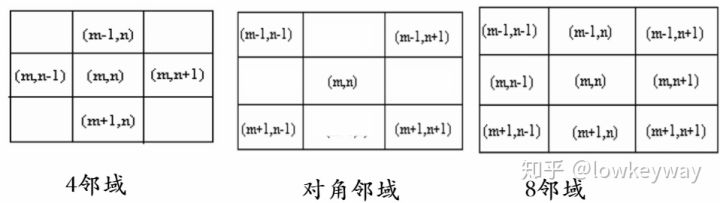
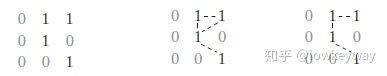
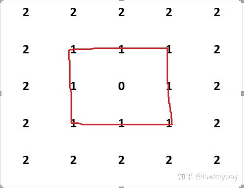
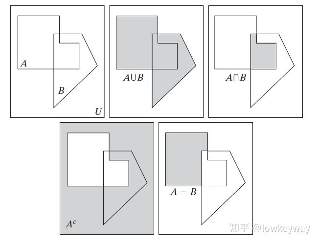

# chapter02-数字图像基础

## 2.4 图像取样和量化

### 2.4.4 图像内插

**Q**：图像内插有什么用？

**A**：内插是在诸如放大、收缩、旋转和几何校正等任务中广泛应用的**基本工具**。

说明：

## 2.5 像素间的一些基本关系

**Q**：本节主要讲了啥？

**A**：本节主要研究了**像素之间的空间关系**。图像是由像素组成的，像素在图像**空间**上按**规律排序**，相互之间有一定的联系，本节就是研究**像素之间的空间关系**。

### 2.5.1 相邻像素

**Q**：领域的**定义**？

**A**：在一定意义下（当然是人赋予的意义了），与某一像素**相邻的**像素的**集合**。领域反应了像素的**空间关系**，**与像素的值得大小无关**。

**Q**：邻域可以分为几类？

**A**：3种邻域：4邻域($N_{4}(p)$:像素p的4邻域构成的像素集合)、对角邻域($N_{D}(p)$)、8邻域。

### 2.5.2 邻接性、连通性、区域和边界

#### 邻接性

**说明**：理解数学上的充分必要关系、邻接类似于扫雷！

**Q**：邻接（connectivity）的**定义**？

**A**：**空间上相邻，且像素灰度值相似。**

**Q**：邻接和邻域的**关系**是什么？

**A**：**邻域**是**邻接**的**前提**。

**Q**：如何判断是否是邻接关系？

**A**：

1）是否接触（邻域关系？）

2）灰度值是否满足某个特定的**相似准则**V：灰度值相等、同一个**灰度值集合**中。

**Q**：邻接可以分为几类？

**A**：3种邻接：4邻接、8邻接、m-邻接（混合邻接）。

**Q**：4邻接、8邻接的应用场景有哪些？

**A**：模式识别、图像测量等领域。

**Q**：如何邻域来进行**模式识别**？

**A**：利用像素两两之间满足**4邻接**还是**8邻接**关系进行模式识别。

**Q**：为什么说**邻域关系**、**邻接关系**在图像领域特别重要？

**A**：因为这影响了图像处理的结果。

**Q**：由于2个像素既可以为4邻接也可以为8邻接，这样就存在2条通路（也可以看做是回路），为了避免回路，该如何解决这一问题？

**A**：引入m-邻接（混合邻接）消除2条通路的问题，即优先使用4邻接而不使用8邻接。

**Q**：m-邻接的定义是什么？

**A**：具体定义见书本P39，可视化例子的见视频32’（视频中说交集是”空集“，其实是错误的，应该以书本上的为准）。

#### 连通性

**例子**:

前提：定义区域时，必须指明灰度相似性准则 V= { };一个区域和其背景中的点之间的邻接要根据8连通来定义。

- 红线走穿过的像素是0像素的8邻接，它构成的路线就叫做**通路。**

- 同这个例子所示，如果通路是闭合的，就叫做**闭合通路**。

- 也可以根据邻接性定义，比如这个例子可以叫做**8通路**。

- 令红线穿过的像素集合为S，那么S中包含的任意两个像素p和q在S中是**连通**的。

- 对于任意一个属于集合S的像素q，集合S中连通到像素q的像素集成为q的**连通分量**。如果S仅有一个连通分量，则集合S称为**连通集**。

**Q**：为什么要研究**连通性**？

**A**：连通性反映了2个像素之间的**空间关系**。

**Q**：通路的定义？

**A**：

1）**独立像素**组成；

2）**任意相邻**像素之间满足**邻接**关系。

**Q**：连通的定义？

**A**：通路上的所有像素灰度值满足相似准则。

**Q**：连通的分类？

**A**：4-连通、8-连通、m-连通。

### 2.5.3 距离度量

**Q**：距离的定义？

**A**：数字图像处理中将距离定义为满足3个条件的距离函数或度量。具体定义见课本吧。

**Q**：欧式距离的定义？

**A**：一般意义上的2点之间的直线距离（直角三角形的斜边）。

**Q**：城市距离的定义？

**A**：见课本P40或见视频44‘。

## 2.6 数字图像处理中所用数学工具的介绍

### 2.6.1 阵列与矩阵操作

### 2.6.2 线性操作与非线性操作

### 2.6.3 算术操作

### 2.6.4 集合和逻辑操作

Q:如何理解集合的基本概念?

A:

### 2.6.5 空间操作

**Q**：空间操作如何分类？

**A**：

1）单像素操作；

2）邻域操作；

3）几何空间变换。

**Q**：图像为什么会出现**几何失真**？

**A**：图像在生成过程中，由于**系统本身具有非线性**或**拍摄角度**不同，会产生生成的图像产生几何失真。

**Q**：几何失真如何**分类**？

**A**：几何失真一般分为**系统失真**和**非系统失真**。系统失真是**有规律的**、**能预测的**；**非系统失真**则是**随机的**。（本节**研究的范畴**是系统失真）。

**Q**：几何变换的**应用场景**有哪些？

**A**：

1）**镜头畸变**：如鱼眼相机；

2）**遥感图像校正**：由于地球自转产生的相机与地球上物体的相对运动；

3）**图像配准**：目标发生运动，如旋转和平移。

**Q**：图像配准有哪些**应用场景**？

**A**：医学图像、遥感图像、电子装配等领域。

**Q**：几何变换的**特性**？

**A**：几何变换**不改变像素值**，仅**改变像素所在位置**。

**说明**：几何变换可以**改变图像中物体之间的空间关系**。这种运算可以看成是图像内的各物体在图像内移动的过程。例如，物体的转动、扭曲、倾斜、拉伸等，都是几何运算的结果。

**Q**：基本几何变换**数学定义**是什么？

**A**：见参考资料2的9'。

**Q**：常用的基本几何变换有哪些？

**A**：平移变换、镜像变换、旋转（rotate）变换、放缩（scale）变换、拉伸变换。

**说明**：最常用的空间坐标变换之一是放射变换（affine transform）。

**Q**：**仿射变换**的矩阵形式是什么？

**A**：见书本P50公式（2.6-23）。

**Q**：基于式（2.6-23）的仿射变换有哪些？

**A**：恒等变换、尺度变换、旋转变换、平移变换、（垂直）偏移变换、（水平）偏移变换。需要知道这些变换的矩阵形式，具体见书本P51的表2.2.

**Q**：**透视变换**的**定义**？

**A**：透视变换是中心投影的射影变换，具体数学表达式见参考资料[5]的**3.2 透视变换**。

**Q**：镜像如何**分类**？

**A**：镜像包括**水平镜像**和**垂直镜像**两种。

**Q**：水平镜像和垂直镜像有什么**特性**？

**A**：水平镜像y轴不变，x轴变；垂直镜像x轴不变，y轴变。

**注意**：转置和旋转90度不同，二者呈镜像对称。

**Q**：如何理解旋转变换？

**A**：经过**数学推导**，旋转后的坐标只与**旋转前的坐标**和**旋转的角度**这2个因素有关。

**Q**：图像旋转的实际过程是什么？

**A**：对于图像旋转，通常的做法是**以图像的中心为圆心旋转**，具体步骤如下：

1）图像中心**平移**到原点；

2）顺时针**旋转**；

3）图像中心**平移**回原位置。

可以通过数学推导，就以上3个步骤的矩阵乘积为1个矩阵，然后再和旋转前的向量相乘，具体见参考资料2的40'。

**Q**：在平面中，一个点绕**任意一个点**旋转**任意角度**后的坐标怎么算？

**A**：见参考资料[4]。

**Q**：图像旋转会产生什么**问题**？

**A**：旋转后的图像会产生**锯齿**、**断裂**、**小桥**、**网纹**。

### 2.6.6 向量与矩阵操作

### 2.6.7 图像变换

### 2.6.8 概率和随机变量（Probability and Random Variables）

**样本空间、事件和概率（Sample Spaces, Events, and Probability）**

**小结**：本小节介绍了（随机试验（random experiment）、样本空间、事件、概率）的定义。

**Q**：随机试验的定义？

**A**：试验结果无法确定，但是所有可能的结果的集合可以确定。

**Q**：样本空间的定义？

**A**：随机试验的所有结果构成的集合叫样本空间。

**Q**：事件的定义？

**A**：样本空间的子集叫事件。

**Q**：概率的技术背景是什么？

**A**：为了确定一个随机试验发生某个事件的可能性大小，从而引出了概率这个概念。

**Q**：概率的定义？

**A**：概率的定义由3个公理构成，具体见式（2-67）。

axiom 公理

## 参考资料

[1] [数字图像处理 任获荣 05]( https://www.bilibili.com/video/av61178093?p=5 )

[2] [数字图像处理 任获荣 11]( https://www.bilibili.com/video/av61178093?p=11 )

[4] [在平面中，一个点绕任意点旋转θ度后的点的坐标](https://www.cnblogs.com/zhoug2020/p/5797503.html)

[5] [数字图像处理 清华大学 艾海舟 第六章 几何运算](http://media.cs.tsinghua.edu.cn/~ahz/digitalimageprocess/chapter06/chapt06_ahz.htm)

