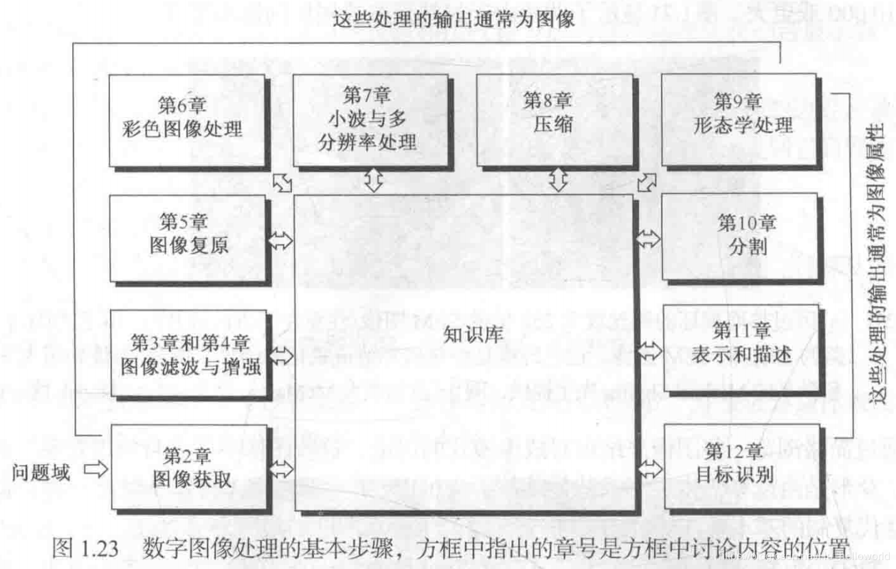

## chapter11-表示和描述（Representation and Description）

## 引言

**Q**：**表示和描述**在图像分析系统中的**地位**？

**A**：

1）**低级处理**：图像获取、预处理；

2）**中级处理**：分割、**表示与描述**；

3）**高级处理**：识别与解释。

**Q**：图像分割结果是什么？

**A**：图像分割结果是得到了区域内的像素集合，或位于区域边界上的像素集合。

Q：什么是表示？

A：表示是直接具体地表示目标。

Q：什么样的表示算是好的表示？

A：好的表示方法应具有节省存储空间、易于特征计算等优点。

Q：什么是描述？

A：描述是较抽象地表示目标。

Q：什么样的描述算是好的描述？

A：好的描述应尽可能区别不同目标的基础上对目标的尺度、平移、旋转等不敏感，这样的描述比较通用。

Q：描述是如何分类的？

A：描述可分为对边界的描述和对区域的描述。此外，边界和边界或区域之间的关系也常常需要进行描述。

Q：表示和描述有什么联系？

Q：表示和描述有什么区别？

说明：对目标特征的测量是要利用分割结果进一步从图像中获取有用信息，为达到这个目的，需要解决2个关键问题：

1）选用什么特征来描述目标？

2）如何精确地测量这些特征？

Q：常见的目标特征有哪些？

Q：描述方法有哪些？

## 11.1 表示

### 11.1.2 链码

Q:链码的基本原理?

A:在图像轮廓上,首先找到起始点,然后使用长度相同,方向可不同的向量链接起来,共同表示图像的轮廓.

**Q**：链码的**用途**是什么？

**A**：**链码用于表示边界**.具体来讲,链码用于表示由**顺次连接的**,**具有指定长度和方向的直线段**组成的**边界**。

**Q**：什么叫**福雷曼（Freeman）链码**？

**A**：以方向性数字序列表示的编码称为福雷曼链码。

Q:链码的优点是什么?

A:**节省计算机的存储空间**.计算机表示边界最笨的方法是存储边界上每个点的坐标$(x_{i},y_{i})$,这种方法浪费空间,使用链码只需保存初始点的坐标信息和后续的链码方向信息就可以了.

**Q**：基本的链码具有什么性质？

**A**：平移不变性（图像平移，链码不变），但是不具有起点不变性（对于同一张图片而言，起始点发生变化，链码将发生变化）和旋转不变性（对于同一张图片而言，图像发生旋转，链码将发生变化）.

Q:如何解决基本链码起点不同,链码也不同的问题?

A:起点归一化链码:

Q:如何解决基本链码旋转之后,链码也不同的问题?

A:一阶差分链码:

## 参考资料

[1] [【公开课】数字图像处理-曹茂永主讲-山东科技大学 国家精品课程 曹茂永 35.图像描述概述、边界]( https://www.bilibili.com/video/av33675799?p=35 )

